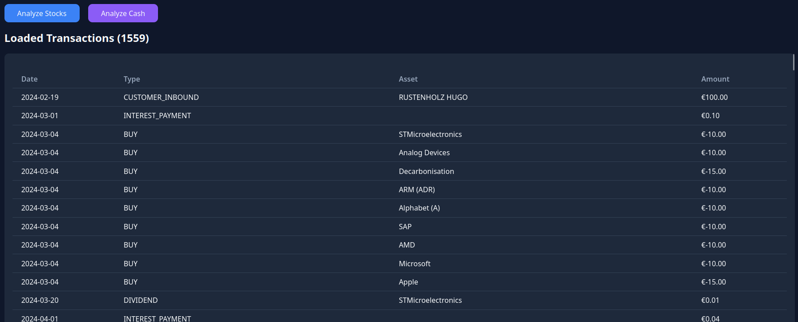
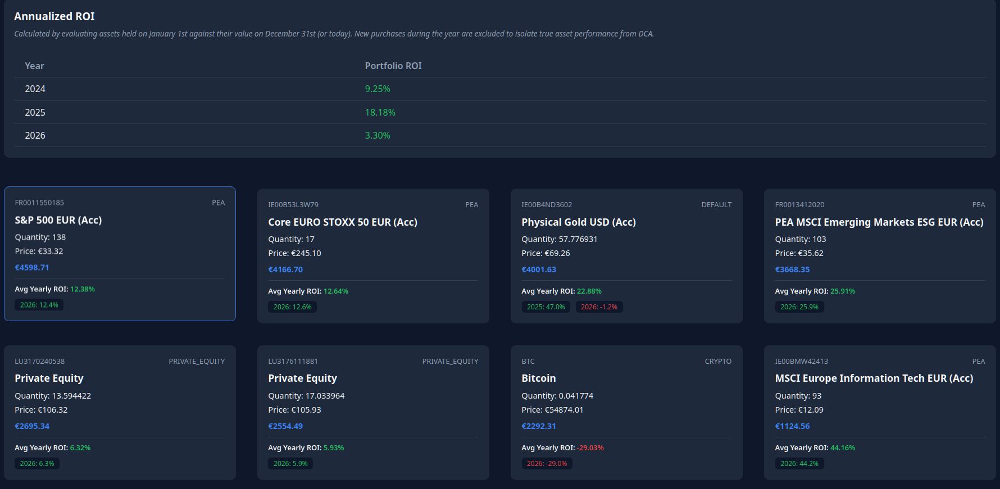
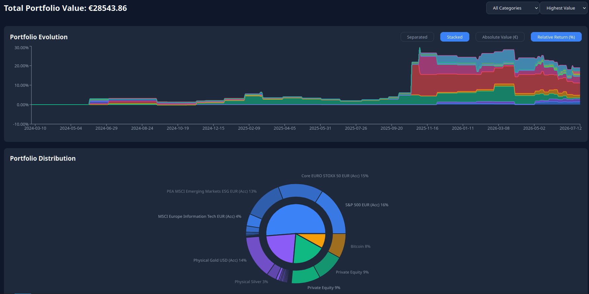
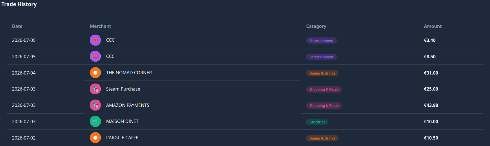
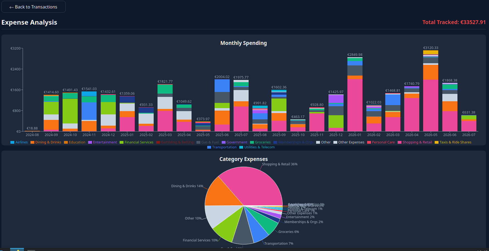

# TR Analyzer

A privacy-focused, client-side analytical tool for your investment and cash transaction history.

> **Disclaimer:** This project is in no way affiliated with, endorsed by, or connected to Trade Republic. It is an independent, community-driven tool designed to help you visualize your own data.

## 🚀 Overview

TR Analyzer is a completely **client-side** web application. It transforms raw CSV exports from your bank's mobile application into actionable financial insights. 

Because the application runs entirely in your browser, **no server is required**. Your financial data never leaves your machine—no APIs to authenticate, no tokens to manage, and no hosting costs. You remain in full control of your data privacy.

### Key Features
* **Privacy First:** All data processing happens locally in your browser.
* **Transaction Breakdown:** Parse and view your full history of deposits, trades, and cash movements.
* **Performance Tracking:** Calculate your portfolio's evolution and Annualized ROI (excluding the noise of recurring deposits/DCA).
* **Expense Analysis:** Automatically categorize cash transactions using Merchant Category Codes (MCC).
* **Visualizations:** Interactive charts powered by `recharts` to view asset distribution and growth.

## 🛠 How It Works

1.  **Export:** Download your transaction history CSV directly from your bank's mobile app.
2.  **Upload:** Drag and drop the CSV file into the TR Analyzer web interface.
3.  **Analyze:** The app parses the file, fetches live market prices via public, non-authenticated endpoints, and generates your reports locally.

## 📸 Screenshots

### Data Import & Transactions
**Import CSV**

**Transactions History**

### Portfolio & Stocks
**Stocks Overview**

**Stocks Performance Chart**

### Expense Tracking
**Expenses List**

**Expenses Distribution Chart**

## 🏗 Built With

This project is built using high-performance modern web technologies:
* **[Bun](https://bun.sh):** Used as the fast runtime and bundler.
* **[React 19](https://react.dev):** For the component-based user interface.
* **[Recharts](https://recharts.org):** For all data visualization components.
* **[PapaParse](https://www.papaparse.com/):** For efficient client-side CSV parsing.
* **AI Collaboration:** A significant portion of the codebase architecture and logic implementation was developed with the assistance of **Gemini (Pro 3.1)**.

## 📝 License & Usage

This project is licensed under a custom license.

* **Non-Commercial Use:** You are free to use, modify, and run this code for your own personal, non-commercial purposes.
* **No Resale:** You are strictly prohibited from selling this code, or from hosting this application and charging others for the use of the service.
* **Contributions:** You are free and encouraged to contribute to the repository to improve the features or fix bugs.

## 🤝 Contributing

Contributions are welcome! If you find a bug, have an idea for a new feature, or want to improve the parsing logic, please feel free to fork the repository and submit a pull request.

---
*Created by RUSTENHOLZ "hell-phi" Hugo.*